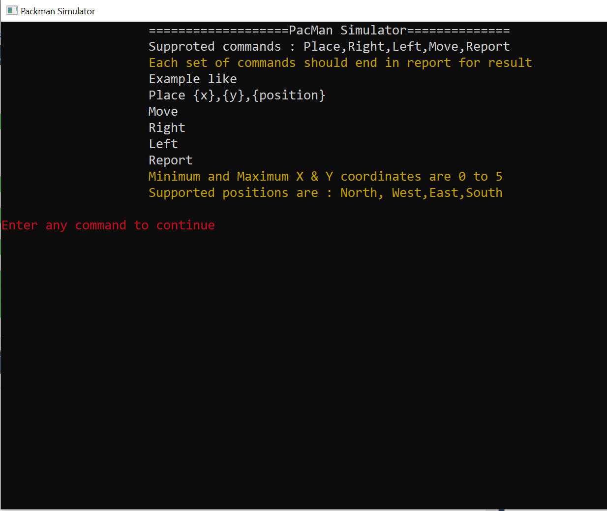
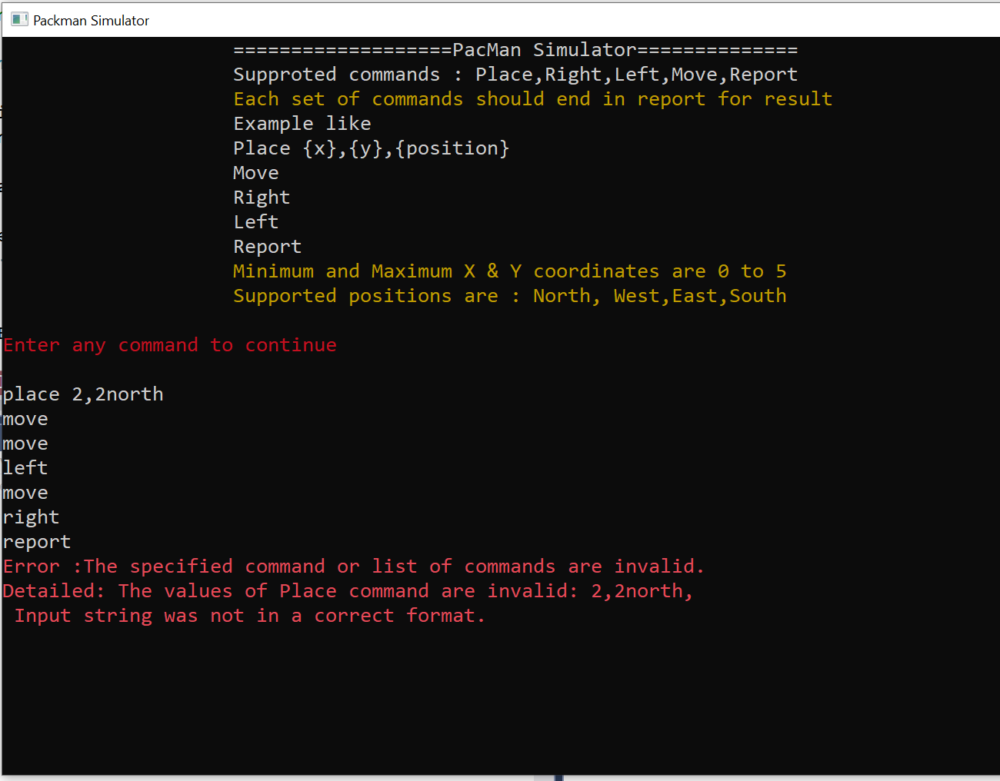
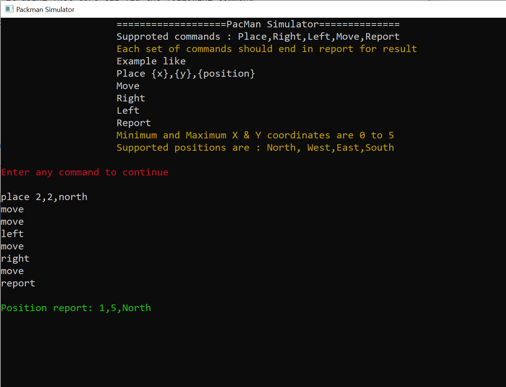

### Pacman Project Structure 
1. This solution is implemented using .Net Core version 2.1 and runs as a console app.

2.  The root directory contains README file, demo sample images and projects folders.Each folder contains the source code  
3. In order to be scalable and maintainable,the Pacman application divided into the following projects.
4. The source code has comment and edge-case and normal scenarios tested via unit tests
--- 
- <b>Pacman.Entities </b>
	- This project provides entities and model classes. Like Commands enumerations, pacman position etc.
- <b>Pacman.Services</b>
  -  This Project provides service interfaces and their logic. Notable services are supported command by pacman like Move, Left, Right, Place.
- <b> Pacman.Processor</b>
  - This project acts as the pacman engine and process a number of commands and position pacman in the correct place. It also reports current position of the pacman.
- <b> Pacman </b>
  - This project is the main entry of application. It parses commands from command line and passes them to pacman processor as it depends on.The parser can parse commands from console and file alternatively. The Runtime parses instructions from command line.
- <b>Pacman.UnitTest </b>
  - This is Unit test projects. Unit test are divided into categories of  test cases : normal  and edge-case scenarios. The commands of each unit test provied by a separate text file in the project directory.

#### How to run the project 

Either build it using .Net core CLI via the following steps 
1. In the root folder run the below command 
	 ```  dotnet.exe build pacman.sln -c Release ```
2. From root folder, navigate to ```Pacman\bin\Release\netcoreapp2.1\ ``` folder and run the following command 
 ```  dotnet.exe .\Pacman.dll ```

OR 

Open the solution via Visual Studio and Run the Pacman project

<b>Example screen When program loads</b>



<b> Key in few invalid commands & validation  </b>



<b> key in few commands and report new position </b>

